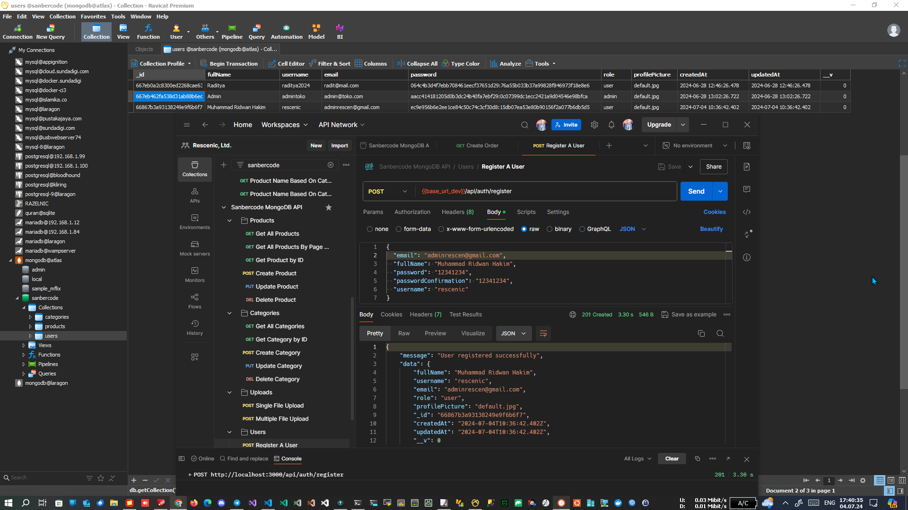
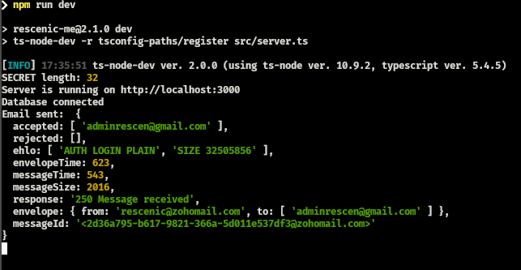
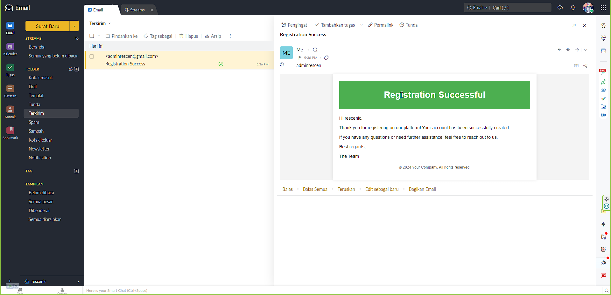
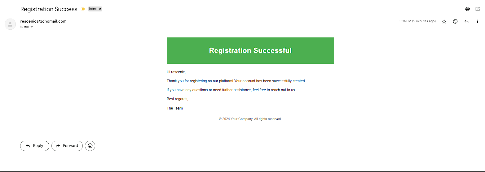
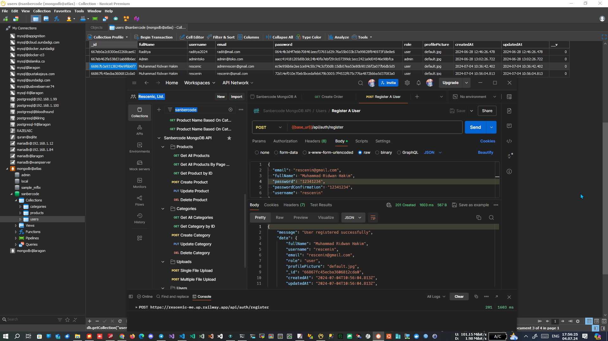
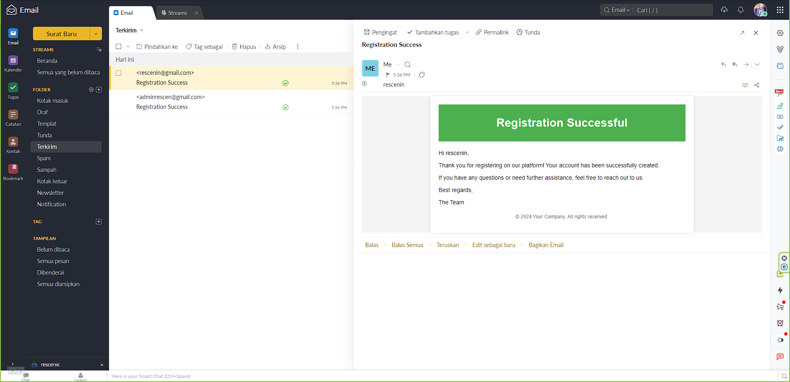
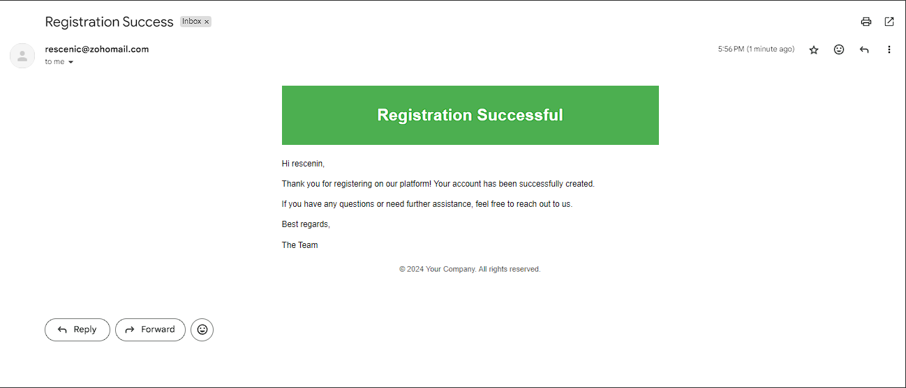

# Final Project Sanbercode MongoDB - Node.JS API

## Muhammad Ridwan Hakim

### Deploy on Railway

<https://rescenic-me.up.railway.app/>

### Deploy on Localhost

```bash
git clone https://github.com/rescenic/final-project-mridwanh.git

cd final-project-mridwanh

npm install

npm run dev
```

### Screenshots

#### 1. (DEV) Create A User with Default Role "user" and send "Registration Success" Email









#### 2. (LIVE) Create A User with Default Role "user" and send "Registration Success" Email







### Import Sanbercode MongoDB API.postman_collection.json to Postman

### API Guides
