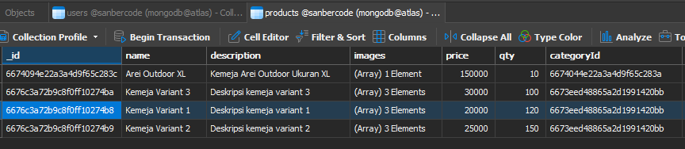
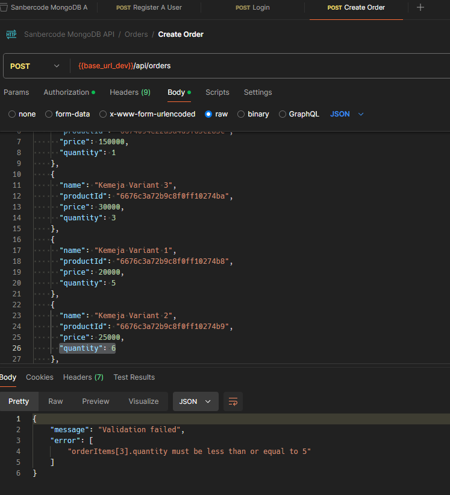
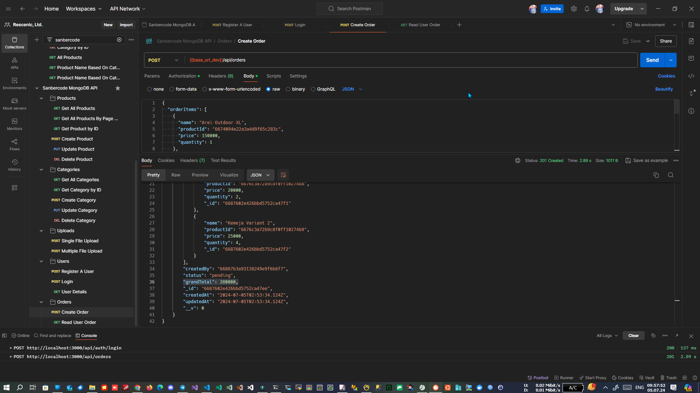
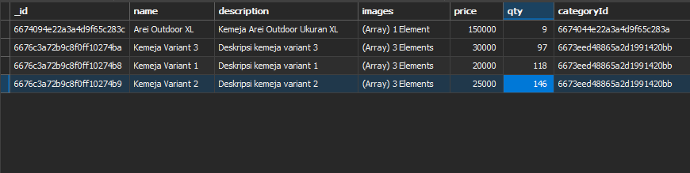
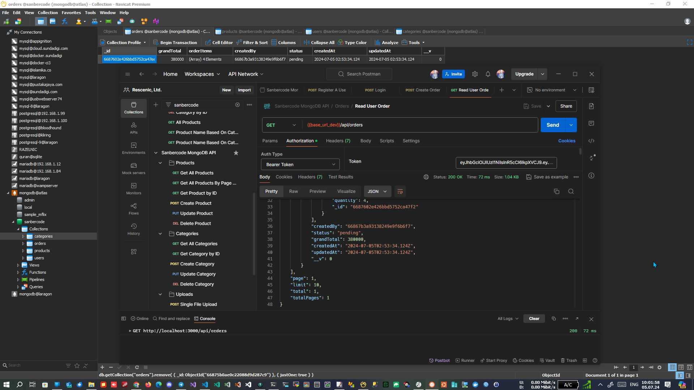
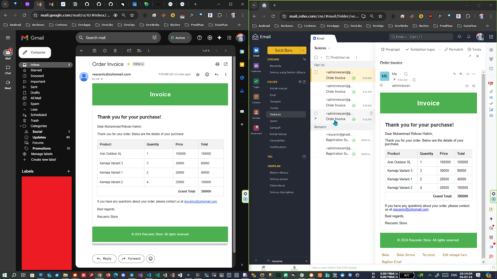

# Final Project Sanbercode MongoDB - Node.JS API

## Muhammad Ridwan Hakim

### Deploy on Railway

<https://rescenic-me.up.railway.app/>

### Deploy on Localhost

```bash
git clone https://github.com/rescenic/final-project-mridwanh.git

cd final-project-mridwanh

npm install

npm run dev
```

### Screenshots

#### 1. (DEV) Create A User with Default Role "user" and send "Registration Success" Email


#### 2. (LIVE) Create A User with Default Role "user" and send "Registration Success" Email


#### 3. (DEV) Create & Read User Order + Send Invoice Email

##### 3.1. Initial Stocks



##### 3.2. Max 5 items per productId to be ordered



##### 3.3. Create order



##### 3.4. Stocks final after previous order



##### 3.5. Get user's order



##### 3.6. Invoice sent



### Import Sanbercode MongoDB API.postman_collection.json to Postman

### API Guides

## Overview

This document provides a guide for using the Sanbercode MongoDB API, which includes endpoints for managing products, categories, uploads, and user authentication.

**Base URLs:**

- Development: `http://localhost:3000`
- Production: `https://rescenic-me.up.railway.app`

## Products

### Get All Products

**Endpoint:** `GET /api/products/`

**Request:**

```http
GET {{base_url}}/api/products/
```

**Description:** Retrieves a list of all products.

### Get All Products By Page & Limit

**Endpoint:** `GET /api/products?page=1&limit=10`

**Request:**

```http
GET {{base_url}}/api/products?page=1&limit=10
```

**Description:** Retrieves a paginated list of products with a specified limit per page.

### Get Product by ID

**Endpoint:** `GET /api/products/:id`

**Request:**

```http
GET {{base_url}}/api/products/:id
```

**Description:** Retrieves details of a product by its ID.

### Create Product

**Endpoint:** `POST /api/products`

**Request:**

```http
POST {{base_url}}/api/products
Content-Type: application/json

{
    "products": [
        {
            "name": "Kemeja Variant 1",
            "description": "Deskripsi kemeja variant 1",
            "images": [
                "https://res.cloudinary.com/five-code/image/upload/v1718805645/fxuurm45mt5talry7a29.png",
                "sepatu2.jpg",
                "sepatu3.jpg"
            ],
            "price": 20000,
            "qty": 120,
            "categoryId": "6673eed48865a2d1991420bb",
            "slug": "variant-1-slug"
        }
        ...
    ]
}
```

**Description:** Creates new products with the provided details.

### Update Product

**Endpoint:** `PUT /api/products/:id`

**Request:**

```http
PUT {{base_url}}/api/products/:id
Content-Type: application/json

{
    "name": "Updated Product",
    "description": "Updated Description",
    "images": ["updated-image-url"],
    "price": 200,
    "qty": 20,
    "categoryId": "updated-category-id"
}
```

**Description:** Updates the details of an existing product.

### Delete Product

**Endpoint:** `DELETE /api/products/:id`

**Request:**

```http
DELETE {{base_url}}/api/products/:id
```

**Description:** Deletes a product by its ID.

## Categories

### Get All Categories

**Endpoint:** `GET /api/categories`

**Request:**

```http
GET {{base_url}}/api/categories
```

**Description:** Retrieves a list of all categories.

### Get Category by ID

**Endpoint:** `GET /api/categories/:id`

**Request:**

```http
GET {{base_url}}/api/categories/:id
```

**Description:** Retrieves details of a category by its ID.

### Create Category

**Endpoint:** `POST /api/categories`

**Request:**

```http
POST {{base_url}}/api/categories
Content-Type: application/json

{
    "name": "Pakaian Outdoor",
    "description": "Kategori khusus pakaian outdoor, semisal hiking, climbing, dan camping."
}
```

**Description:** Creates a new category with the provided details.

### Update Category

**Endpoint:** `PUT /api/categories/:id`

**Request:**

```http
PUT {{base_url}}/api/categories/:id
Content-Type: application/json

{
    "name": "Updated Category",
    "description": "Updated Description"
}
```

**Description:** Updates the details of an existing category.

### Delete Category

**Endpoint:** `DELETE /api/categories/:id`

**Request:**

```http
DELETE {{base_url}}/api/categories/:id
```

**Description:** Deletes a category by its ID.

## Uploads

### Single File Upload

**Endpoint:** `POST /api/upload`

**Request:**

```http
POST {{base_url}}/api/upload
Content-Type: multipart/form-data

file: <path-to-file>
```

**Description:** Uploads a single file.

### Multiple File Upload

**Endpoint:** `POST /api/uploads`

**Request:**

```http
POST {{base_url}}/api/uploads
Content-Type: multipart/form-data

files: <path-to-files>
```

**Description:** Uploads multiple files.

## Users

### Register A User

**Endpoint:** `POST /api/auth/register`

**Request:**

```http
POST {{base_url_dev}}/api/auth/register
Content-Type: application/json

{
    "email": "rescenin@gmail.com",
    "fullName": "Muhammad Ridwan Hakim",
    "password": "12341234",
    "passwordConfirmation": "12341234",
    "username": "rescenin"
}
```

**Description:** Registers a new user.

### Login

**Endpoint:** `POST /api/auth/login`

**Request:**

```http
POST {{base_url_dev}}/api/auth/login
Content-Type: application/json

{
    "email": "adminrescen@gmail.com",
    "password": "12341234"
}
```

**Description:** Logs in a user and returns a token.

### User Details

**Endpoint:** `GET /api/auth/me`

**Request:**

```http
GET {{base_url}}/api/auth/me
Authorization: Bearer <token>
```

**Description:** Retrieves the details of the authenticated user.

## Orders

### Create Order

**Endpoint:** `POST /api/orders`

**Request:**

```http
POST {{base_url_dev}}/api/orders
Authorization: Bearer <token>
Content-Type: application/json

{
    "orderItems": [
        {
            "name": "Arei Outdoor XL",
            "productId": "6674094e22a3a4d9f65c283c",
            "price": 150000,
            "quantity": 1
        },
        {
            "name": "Kemeja Variant 3",
            "productId": "6676c3a72b9c8f0ff10274ba",
            "price": 30000,
            "quantity": 3
        },
        {
            "name": "Kemeja Variant 1",
            "productId": "6676c3a72b9c8f0ff10274b8",
            "price": 20000,
            "quantity": 2
        },
        {
            "name": "Kemeja Variant 2",
            "productId": "6676c3a72b9c8f0ff10274b9",
            "price": 25000,
            "quantity": 4
        }
    ]
}
```

**Description:** Creates a new order with the provided items.

### Read User Order

**Endpoint:** `GET /api/orders`

**Request:**

```http
GET {{base_url_dev}}/api/orders
Authorization: Bearer <token>
```

**Description:** Retrieves the order history of the authenticated user.
