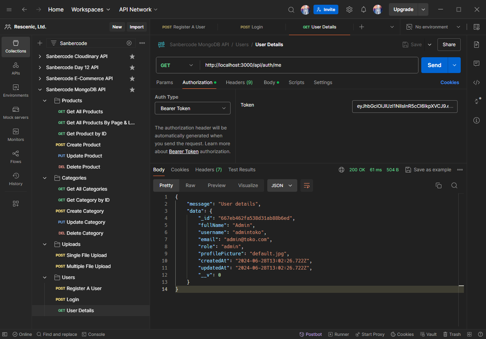
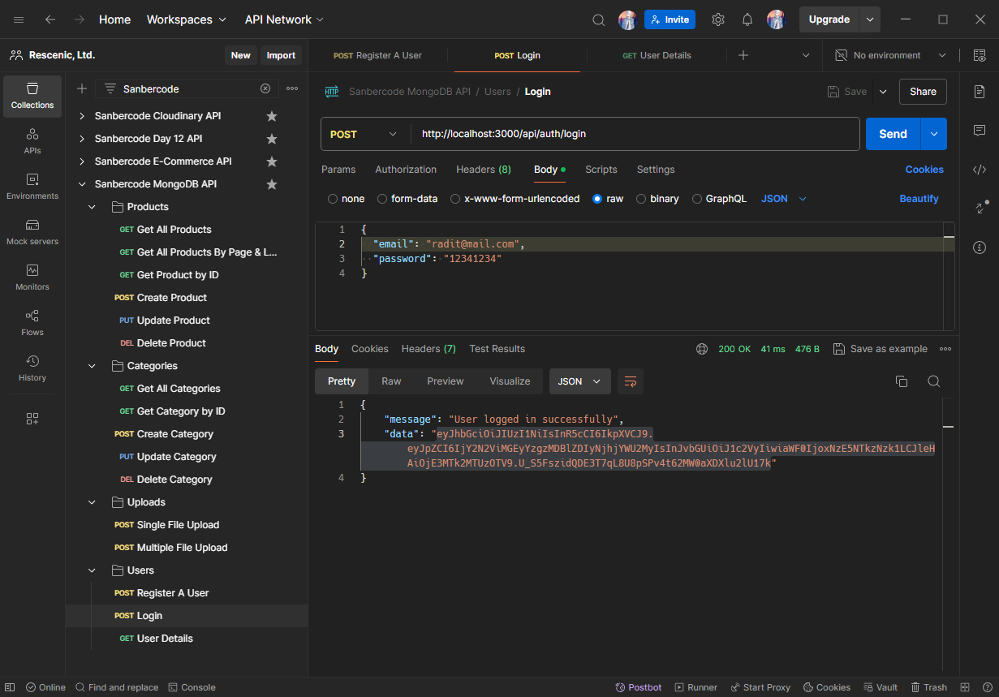
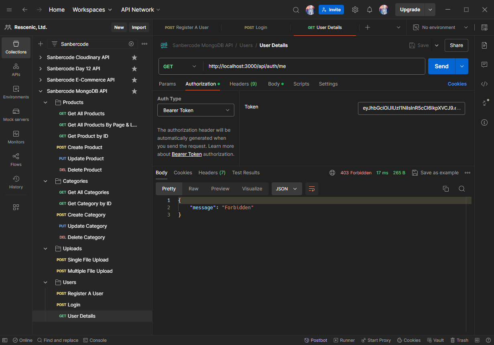

# Final Project Sanbercode MongoDB - Node.JS API

## Muhammad Ridwan Hakim

### Deploy on Localhost

```bash
git clone https://github.com/rescenic/sanber-be-57-final-project-mridwanh.git rescenic-me

cd rescenic-me

npm install

npm run dev
```

### Import Sanbercode MongoDB API.postman_collection.json to Postman

### Screenshots

#### 1. Admin Can Access User Details



#### 2. User Login To Get JWT



#### 3. User Can't Access User Details



### Deploy on Railway

<https://rescenic-me.up.railway.app/>
